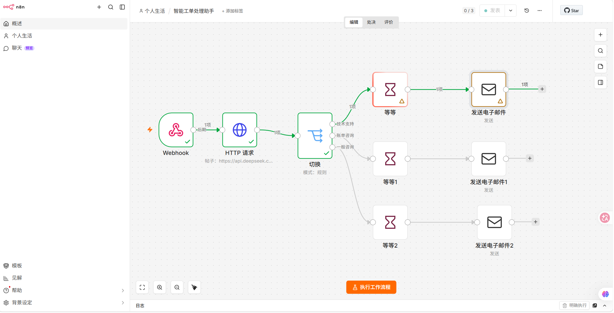
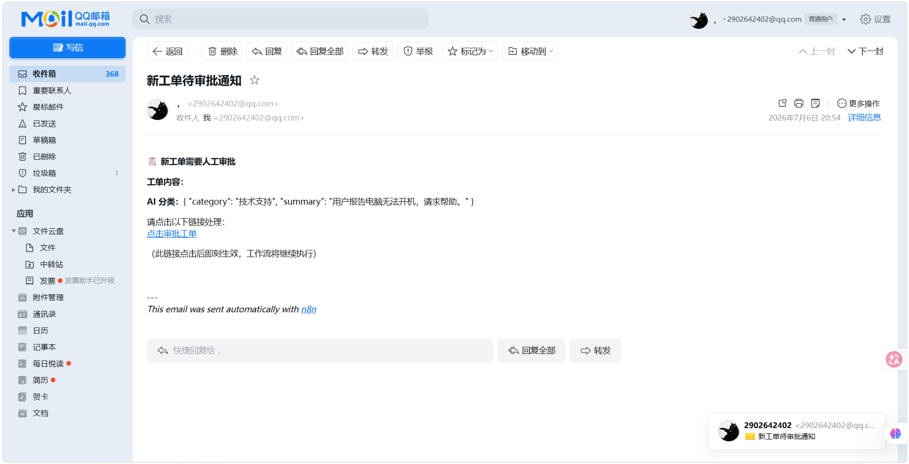

# 基于 N8N + AI 的自动化工单处理工作流

> 通过 N8N 工作流自动化平台与 DeepSeek API 结合，实现工单自动接收、AI 智能分类、自动路由、异步人工审批与超时兜底机制。

---

## 📌 项目简介

本项目针对企业工单处理中人工分类效率低、路由慢、审批流程不可控的痛点，设计并实现了一套智能化工单自动处理系统。通过 N8N 可视化编排与 DeepSeek 大模型结合，实现工单从接收、分类、路由到异步审批的全流程自动化。

**核心价值：**
- 工单分类实现全自动化，准确率 **90% 以上**
- 审批流程无需登录系统，点击邮件链接即可完成
- 4 小时超时兜底机制，保障工单不积压
- 人工介入减少约 **60%**，审批效率提升约 **50%**

---

## 🏗️ 技术架构

| 层级 | 技术选型 | 说明 |
|------|---------|------|
| 工作流平台 | **N8N**（开源版） | 可视化工作流编排 |
| 大语言模型 | **DeepSeek API** | 工单意图分类与摘要提取 |
| 部署方式 | **Docker Compose** | 私有化一键部署 |
| 通知渠道 | **SMTP（QQ邮箱）** | 发送审批链接邮件 |

---

## 🚀 工作流结构
Webhook → HTTP Request(DeepSeek) → Switch
→ 技术支持 → Wait(4h超时) → Send Email(审批通知)
→ 账单咨询 → Wait(4h超时) → Send Email(审批通知)
→ 一般咨询 → Wait(4h超时) → Send Email(审批通知)


---

## 🎯 核心功能

| 功能 | 说明 |
|------|------|
| 工单自动接收 | Webhook 接口接收外部工单提交 |
| AI 智能分类 | DeepSeek API 识别工单类型（技术支持/账单咨询/一般咨询） |
| 工单自动路由 | Switch 节点根据分类分流到不同分支 |
| 异步人工审批 | Wait 节点暂停工作流，生成唯一恢复链接 |
| 邮件通知 | 通过 SMTP 发送审批链接到审批人邮箱 |
| 超时兜底 | 4 小时超时自动恢复，触发管理员通知 |

---

## 📂 项目文件说明

| 文件 | 说明 |
|------|------|
| `智能工单处理助手.json` | N8N 工作流导出文件，可直接导入 |
| `docker-compose.yml` | N8N Docker 部署配置 |
| `docs/` | 效果截图文件夹 |

---

## 📸 效果演示

### 工作流结构


### 邮件通知



---

## ⚙️ 部署步骤

### 1. 启动 N8N

```bash
docker-compose up -d

### 2. 访问 N8N

```bash
http://localhost:5678

### 3. 导入工作流

在 N8N 中点击 “Import from File”，选择 智能工单处理助手.json

### 4. 配置凭证

配置 DeepSeek API Key

配置 SMTP 凭证（QQ邮箱）

### 5. 发布工作流

点击 “Publish” 发布，即可开始使用

